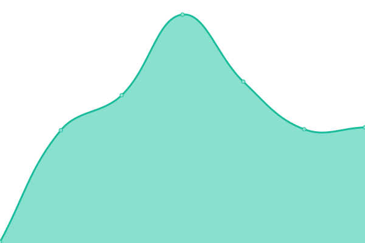

# [📈 Live Status](https://Aurinko-Yoxel.github.io/aurinko-upptime): <!--live status--> **🟩 All systems operational**

This repository contains the open-source uptime monitor and status page for [Aurinko-Yoxel](https://Aurinko-Yoxel.github.io/aurinko-upptime), powered by [Upptime](https://github.com/upptime/upptime).

With [Upptime](https://upptime.js.org), you can get your own unlimited and free uptime monitor and status page, powered entirely by a GitHub repository. We use [Issues](https://github.com/Aurinko-Yoxel/aurinko-upptime/issues) as incident reports, [Actions](https://github.com/Aurinko-Yoxel/aurinko-upptime/actions) as uptime monitors, and [Pages](https://Aurinko-Yoxel.github.io/aurinko-upptime) for the status page.

<!--start: status pages-->
<!-- This summary is generated by Upptime (https://github.com/upptime/upptime) -->
<!-- Do not edit this manually, your changes will be overwritten -->
<!-- prettier-ignore -->
| URL | Status | History | Response Time | Uptime |
| --- | ------ | ------- | ------------- | ------ |
|  [Aurinko API](https://api.aurinko.io/v1/health/check) | 🟩 Up | [aurinko-api.yml](https://github.com/Aurinko-Yoxel/aurinko-upptime/commits/HEAD/history/aurinko-api.yml) | 

 218ms
     
 | 

<a href="https://Aurinko-Yoxel.github.io/aurinko-upptime/history/aurinko-api">99.54%</a>
    

|  [BrightSync API](https://sync.aurinko.io/api/v2/ping) | 🟩 Up | [bright-sync-api.yml](https://github.com/Aurinko-Yoxel/aurinko-upptime/commits/HEAD/history/bright-sync-api.yml) | 

 226ms
     
 | 

<a href="https://Aurinko-Yoxel.github.io/aurinko-upptime/history/bright-sync-api">100.00%</a>
    

<!--end: status pages-->

[**Visit our status website →**](https://Aurinko-Yoxel.github.io/aurinko-upptime)

## 📄 License

- Powered by: [Upptime](https://github.com/upptime/upptime)
- Code: [MIT](./LICENSE) © [Anand Chowdhary](https://anandchowdhary.com), supported by [Pabio](https://pabio.com)
- Data in the `./history` directory: [Open Database License](https://opendatacommons.org/licenses/odbl/1-0/)
